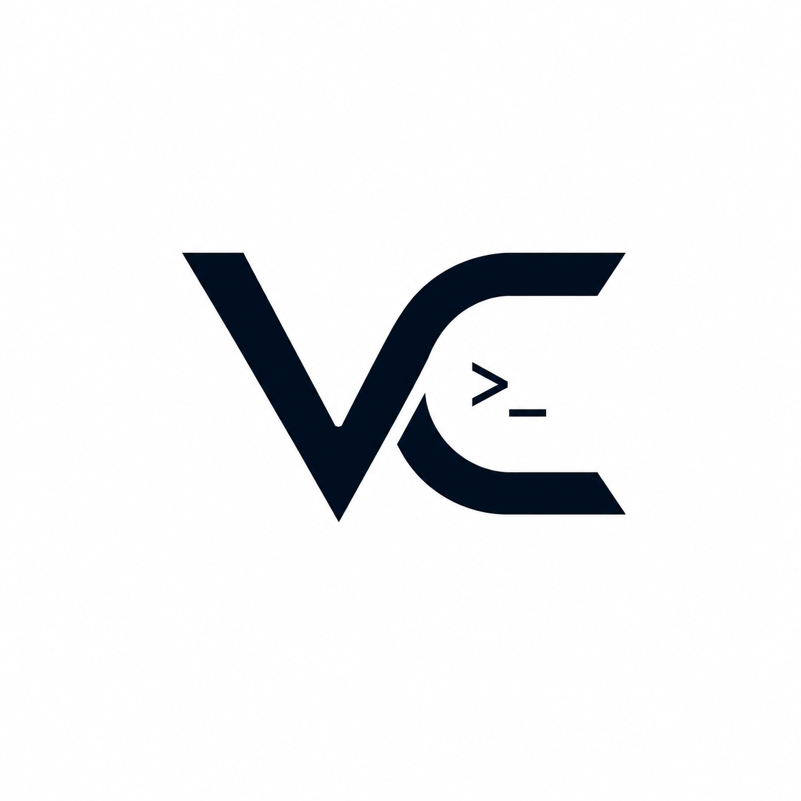

<p align="center">
  
</p>

<h1 align="center">Vato Canvas</h1>

An infinite-canvas **cockpit** to drive multiple AI coding CLIs at once — Claude Code, Codex, Cursor, OpenCode, Antigravity — plus an integrated browser and an Excalidraw whiteboard, all as draggable/resizable floating windows on a pan-and-zoom canvas.

Built with **Tauri v2** (Rust) + **React 19** + **TypeScript** + **Vite**.

## Features

- **Multi-CLI terminals** — each agent runs in a real PTY (ConPTY on Windows via `portable-pty`). Per-CLI accent colour + SVG icon, and a random call-sign (Skye, Chase, Nova…) per spawn.
- **Intelligent border** — orange (running) → blue (just finished) → fades to none (idle); red on error. Driven by live output activity.
- **Infinite canvas** — wheel to zoom toward the cursor, Space-drag or middle-mouse to pan. Windows auto-raise to front on interaction.
- **Integrated browser** — an in-canvas iframe pane with URL bar + history; loads localhost dev servers and most sites (framing-hostile sites excepted).
- **Whiteboard** — Excalidraw with a **Send to AI** button that exports the scene to PNG and drops the file path into the most-recently-used terminal.
- **Workspaces** — multiple named workspaces with a tab switcher and a grid overview; per-workspace background (gradient presets, image, or video) with adjustable dim.
- **Fullscreen** any pane (terminal / browser / whiteboard); `Esc` to exit.
- **Paste image into a terminal** — `Ctrl+V` an image onto a terminal pane: a thumbnail flashes in the centre, the image is saved to a temp file, and its path is typed into the CLI.
- **Voice bar** — stub UI for the upcoming voice-control milestone.

## Prerequisites

- Node ≥ 20 + **pnpm**
- **Rust** (stable, MSVC toolchain on Windows) + Visual Studio Build Tools
- WebView2 runtime (preinstalled on Windows 11)

## Develop

```bash
pnpm install
pnpm tauri dev      # compiles Rust, starts Vite on :1420, opens the app
```

## Build

```bash
pnpm tauri build    # bundles to src-tauri/target/release/bundle/
```

## Architecture

```
src/
├─ canvas/      Canvas + pan/zoom gestures
├─ windows/     WindowFrame (react-rnd, intelligent border, fullscreen)
├─ panes/       TerminalPane (xterm↔PTY) · BrowserPane (iframe) · WhiteboardPane (Excalidraw)
├─ hooks/       useTerminal (xterm + fit + webgl/canvas fallback)
├─ ui/          TopBar · LeftToolbar · VoiceBar · GridOverview · BackgroundLayer · icons
├─ data/        CLI registry (icon/colour/program) · random name pool
├─ lib/         clipboard image paste · cross-pane event bus
├─ store.ts     zustand store (workspaces / windows / view) with persistence
└─ pty.ts       JS client for the Rust PTY commands + events

src-tauri/
├─ src/pty.rs   portable-pty spawn/write/resize/kill, base64 output events,
│               Windows shim resolution (.cmd/.ps1) + tree-kill (taskkill /T)
└─ src/lib.rs   Tauri builder, command handlers, save_temp_image, cli_check
```

### Notes

- **PTY output** is streamed as base64 over `pty://output/<id>` events (binary-safe for ANSI / partial UTF-8); stdin is base64 too.
- **Windows CLI shims**: npm-installed CLIs are usually `.cmd`/`.ps1` shims that `CreateProcess` can't launch directly, so the backend resolves them via `which` and wraps them in `cmd.exe /c` or `powershell -File`.
- **Switching workspaces** unmounts panes but does **not** kill running PTYs — agents keep working in the background and re-attach when you come back.
- The browser pane is a DOM **iframe** (not a native webview) on purpose: only a DOM node can be CSS-transformed, z-ordered, and dragged together with the other canvas windows.
